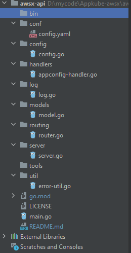

- awsx-api
- project architecture
- api-endpoint ( curl commad)
- build/run/debug/test in postman
- how to add a handler
- 

# awsx-api
awsx-api is a golang based REST api server that exposes GET, POST, DELETE and PUT endpoints that will subsequently allow us to perform the full range of operations on AWS entities.\

# project architecture

    NOTE: To perform operation on AWS entities, awsx-api uses aws-sdk and go cli packages written specifically to deal with AWS entities

    1. main.go
        To get started we have to create a web server which can handle HTTP requests. 
        To do this we have a file called main.go.
        The main function in main.go kiks off the server.
    
    2. Configuration
        * config.yaml: config.yaml is the main configuration file which contain all the server configuration like IP address, port etc.

                server:
                    address: localhost
                    port: 7000
                    static_content_root_directory: /home/userTests/awsx-api-static-files
                    cors_allow_all: true
                    white_list_urls: http://localhost:3002

        * config.go: All the code of reading the configuration from config.yaml file and creating the global config reference is written in config.go  

    3. server
        * server.go: server.go contains the code to create, start and stop the web server

    4. routing
        * For http routing, awsx-api uses the gorilla/mux router 
        * router.go: It contains the logic to create new router and all the http end-points are defined in router.go
    
    5. handlers
        * All the business logic to interact with different AWS entities and perform operations on them will be written in handlers package
            1. appconfig-handler.go: It gets the resource config summary of any AWS account

    6. models
        * models.go: models.go will have all the models needed in api operations

    7. log
        * log.go: A custom log.go created for awsx-api.

# api-endpoint 
       